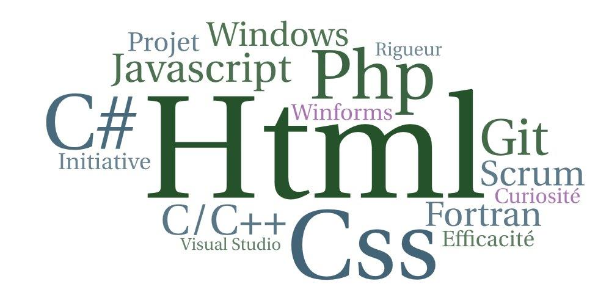

## **0005_portfolio**

## Consigne :
Créer un BEAU portfolio comportant :
* Nom et prénom
* Description
* Coordonnées
* lien sur CV html
* Réalisations front-end

## Structure de la page :

### Nom :
BUFERNE

### Prénom :
Isabelle

### Vignette image : 

### Description :
 * En formation de TP Développeur Web & Mobile à l'AFORMAC de Montluçon
 * Ingénieur logiciel C/C++ Windows
 * Je recherche un poste de développeur logiciel ou Web

### Coordonnées :
isabu77@gmail.com - 06 67 46 23 33

### Formulaire de contact : 
* Pour me contacter
* adresse mail - tél

## Maquette :
### Image : 

